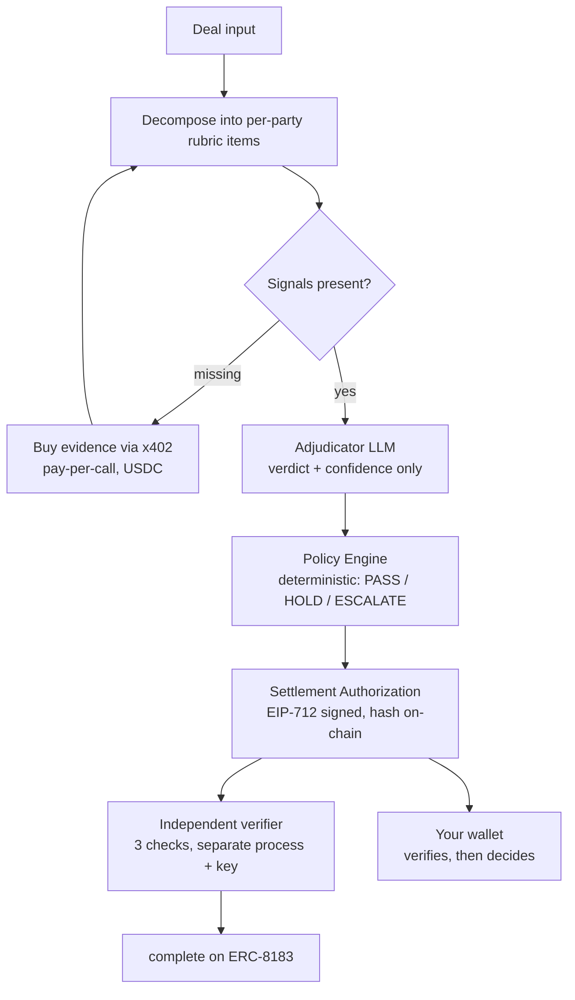

<div align="center">

# Citely Deal Desk

**Turn a cross-border compliance question into a Settlement Authorization
— a conditional proof your own wallet verifies before it releases a cent.**

[](https://docs.arc.io)
[](https://eips.ethereum.org/EIPS/eip-8183)
[](https://developers.circle.com)
[](#validation)
[](#why-deterministic)

[中文文档](README.zh-CN.md) · [Compliance Module service](https://github.com/web3yaso/msb-agent)

</div>

---

## Project Overview

Before money crosses a border, someone has to answer: *can this leg be paid, and under
what conditions?* Today that answer arrives as an email from a lawyer. It cannot be
recomputed, audited, or acted on by software.

Deal Desk produces a **Settlement Authorization (SA)** instead — a signed, hash-anchored
document binding a specific job, payee, amount, module version, evidence hash and expiry.
Your wallet verifies it independently and decides for itself whether to pay.

> **An SA is a conditional proof, not a payment instruction.**
> Citely never touches client funds and never authorizes a payment.

> Output is a set of check statuses compiled from public legal sources. Not legal advice.

---

## Problem

| | |
|---|---|
| **The question** | A US payer settling with agents in SG / UK / DE — is each leg in scope for money-transmitter rules, exempt, or genuinely unclear? |
| **Today** | Human review. Not reproducible, not auditable, not machine-readable. |
| **The gap** | Wallets can execute payments but cannot *verify* whether they should. |

---

## Why Deterministic

The obvious build is "ask a large model." We did not, and the architecture makes that
claim checkable rather than rhetorical.

**`PASS` / `HOLD` / `ESCALATE` are derived only from a compliance module's returned
`settlement_constraints`.** The language model orchestrates and summarizes; it cannot
move a single leg from HOLD to PASS.

This is enforced two ways, both verifiable in the repo:

- **Compile time** — the signature of `deriveCondition()` in
  `packages/engine/src/policy/condition.ts` cannot receive a model verdict. Passing one
  does not type-check.
- **Run time** — injection regression **A7** feeds the system a fully subverted model
  output (`verdict: confirmed_exempt`, forged `source_refs`, wrong `item_id`) and asserts
  every `legs[].condition` is byte-identical to the honest run.

The demo prints this live:

```
· verdict distribution: gray_data×3 confirmed_in_scope×2
[4/7] adjudication: legs=1 condition=HOLD (derived from module result, unrelated to the verdicts above)
```

Five model verdicts on screen; the release condition ignores all of them.

---

## How It Works



Four layers; only the middle one is ours.

| Layer | Owner |
|---|---|
| Compliance module service | Third party, called per-request over x402 |
| **Adjudication engine + verifier** | **Citely** |
| ERC-8183 escrow, x402, USDC | Arc standard components |
| Executing wallet | **Yours** |

---

## Getting Started

```bash
pnpm install
cp .env.example .env          # five chain keys + OpenAI key; every field documented inline

# 1. health check — prints ✅/❌ per item, never prints a key
node --import tsx scripts/doctor.ts

# 2. pre-fund the procurement wallet (x402 spends Gateway balance, not wallet balance)
node --import tsx scripts/gateway-deposit.ts 1.50

# 3. run a case
node --import tsx demo/run-vertical-slice.ts --dry-run   # no transactions, no spend
node --import tsx demo/run-vertical-slice.ts             # real Arc Testnet
```

> **Gateway balance ≠ wallet balance.** x402 spends the former; deposits take minutes to
> land. `doctor` shows both on separate lines for exactly this reason.

> **Use the backup RPC.** The public `rpc.testnet.arc.network` rate-limits under load
> (observed: `request limit reached`). Failover is implemented, but for demos set
> `ARC_RPC_URL=https://arc-testnet.drpc.org`.

---

## What You Get

```json
{
  "case_id": "citely-demo-0001",
  "bound_to": { "job_id": "159786", "expires_at": "2026-08-04T00:00:00.000Z" },
  "modules_used": [{ "module_id": "us-msb", "version": "2026.07.1", "evidence_hash": "efdd1d1c…" }],
  "legs": [{
    "party": "uk_service_agent",
    "payee": "0x…",
    "condition": "HOLD",
    "basis": [{ "item_id": "MT-03", "verdict": "gray_data", "source": "31 CFR § 1010.100(ff)" }],
    "confidence": "gray_data_resolved"
  }],
  "attestation": { "sa_hash": "0xa6a6ff4a…", "signer": "0x4569…", "signature": "0x…" }
}
```

`condition` is one of `PASS` / `HOLD` / `ESCALATE`. `basis` cites the rubric item and the
statute. `attestation` is an EIP-712 signature by the **operator** key — verified by the
**verifier** key in a separate process, so check ① is never self-signed.

---

## Validation

Everything below was executed, not asserted. Chain records are verifiable on
`testnet.arcscan.app`.

| Evidence | Status | Notes |
|---|---|---|
| End-to-end on Arc Testnet | ✅ | Job 159786 → `complete` |
| Exit 1 — reject before submit | ✅ | Job 159987, evaluator rejects in Funded, full refund |
| Exit 2 — high confidence | ✅ | main line |
| Exit 3 — buy missing evidence | ✅ | settlement `566e5a78-…`, 0.80 USDC really spent |
| Exit 4 — escalate to human | ⚠️ partial | routing + escalation list verified; Review Job funding not run on-chain |
| Exit 5 — timeout refund | ✅ | Job 159988, `claimRefund` → `Expired`, no fee taken |
| SA reproducibility | ✅ | same input → `sa_hash` byte-identical across runs |
| Offline replay | ✅ | `cache_only` reproduces without network |
| Idempotency, 3 cold starts | ✅ | 5 transactions ever sent; ledger stays at 2 rows |
| Injection defense vs real model | ✅ | 10 live calls; verdicts unchanged, no forged sources |
| Test suite | ✅ | 853 passing, 5 packages type-clean |

### Injection defense — read this carefully

Against the real model, all five items self-reported `injection_attempt`. **That is not
the defense.** A different model, or a different phrasing, could miss every one.

The defense is the deterministic union: the sandbox parser detects injection independently
and merges its flags with the model's. **Even if the model misses everything, the flag is
still there.** The live check reports the model's self-report as an *observation*, and
asserts only the union — because that is what actually holds.

---

## Evidence & Artifacts

| Artifact | Where |
|---|---|
| Chain run log, all exits with tx hashes | [`docs/design/testnet-run-log.md`](docs/design/testnet-run-log.md) |
| Architecture & integration contract | [`docs/design/`](docs/design/) |
| Adjudicator provider design & determinism policy | [`docs/design/llm-provider-openai.md`](docs/design/llm-provider-openai.md) |
| Recorded module response (real paid call) | `demo/fixtures/recorded/us-msb.json` |
| Golden adjudications (offline replay) | `demo/golden/adjudication/` |

**Key on-chain facts, learned by running it:**

- ERC-8183's deployed reference implementation differs from the spec prose in three
  places: `fund` has no `expectedBudget`; `setBudget` is **provider-only**; `JobStatus`
  has **six** states including `Expired`.
- `expiredAt` has a **5-minute floor** — a demo of the timeout path must create a
  short-expiry job, or you wait a day.
- On the live deployment `platformFeeBP` and `evaluatorFeeBP` are **0**. Rates are read
  from chain, never hardcoded, so the ledger shows the truth.
- Gas on Arc is paid in USDC — reconcile balance deltas accordingly.

---

## Risks & Limits

| Risk | Where it stands |
|---|---|
| Model determinism | Not relied upon. Reproducibility comes from the golden cache; `temperature=0` is best-effort. |
| Exit 4 on-chain | Engine side complete; Review Job funding not yet executed on-chain. Labeled, not hidden. |
| Public RPC rate limits | Failover implemented and unit-tested; demos should pin the backup endpoint. |
| Royalty line | Recorded from a real paid call. A guard refuses to render it from synthetic data. |
| Compliance content | Demo modules compiled from public sources. Not legal advice. |

---

## License

Arc Testnet demo only, no real funds. Compliance verdicts derive from demo modules built
on public legal sources and do not constitute legal advice.
