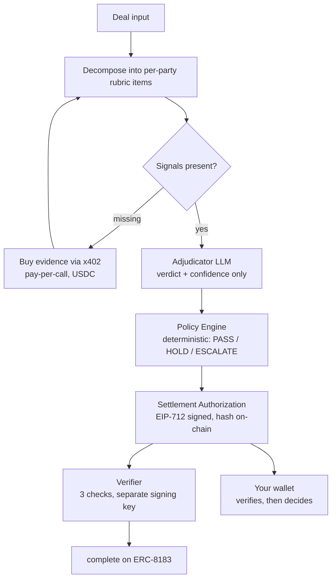
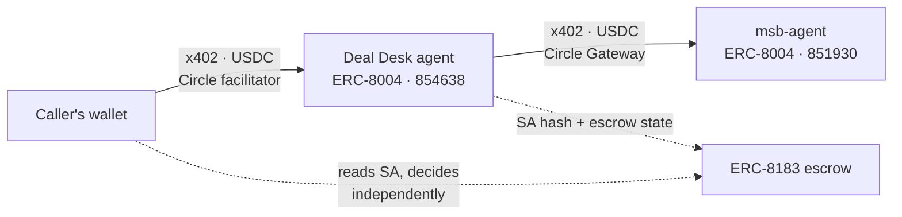

<div align="center">

# Citely Deal Desk

**Turn a cross-border compliance question into a Settlement Authorization
— a conditional proof your own wallet verifies before it releases a cent.**

[](https://docs.arc.io)
[](https://testnet.arcscan.app/tx/0x6385f21b8e1470dc23e25d49d92414c9c432d5d7e34c7ff49a5b631e7f2fd888)
[](https://eips.ethereum.org/EIPS/eip-8183)
[](https://developers.circle.com)
[](#validation)
[](#why-deterministic)

[中文文档](README.zh-CN.md) · [Compliance Module service](https://github.com/web3yaso/msb-agent)

</div>

---

## Project Overview

Before money crosses a border, someone has to answer: *can this leg be paid, and under
what conditions?* Today that answer arrives as an email from a lawyer. It cannot be
recomputed, audited, or acted on by software.

Deal Desk produces a **Settlement Authorization (SA)** instead — a signed, hash-anchored
document binding a specific job, payee, amount, module version, evidence hash and expiry.
Your wallet verifies it independently and decides for itself whether to pay.

> **An SA is a conditional proof, not a payment instruction.**
> Citely never touches client funds and never authorizes a payment.

> Output is a set of check statuses compiled from public legal sources. Not legal advice.

---

## Problem

| | |
|---|---|
| **The question** | A US payer settling with agents in SG / UK / DE — is each leg in scope for money-transmitter rules, exempt, or genuinely unclear? |
| **Today** | Human review. Not reproducible, not auditable, not machine-readable. |
| **The gap** | Wallets can execute payments but cannot *verify* whether they should. |

---

## Why Deterministic

The obvious build is "ask a large model." We did not, and the architecture makes that
claim checkable rather than rhetorical.

**`PASS` / `HOLD` / `ESCALATE` are derived only from a compliance module's returned
`settlement_constraints`.** The language model orchestrates and summarizes; it cannot
move a single leg from HOLD to PASS.

This is enforced two ways, both verifiable in the repo:

- **Compile time** — the signature of `deriveCondition()` in
  `packages/engine/src/policy/condition.ts` cannot receive a model verdict. Passing one
  does not type-check.
- **Run time** — injection regression **A7** feeds the system a fully subverted model
  output (`verdict: confirmed_exempt`, forged `source_refs`, wrong `item_id`) and asserts
  every `legs[].condition` is byte-identical to the honest run.

The demo prints this live:

```
· verdict distribution: gray_data×3 confirmed_in_scope×2
[4/7] adjudication: legs=1 condition=HOLD (derived from module result, unrelated to the verdicts above)
```

Five model verdicts on screen; the release condition ignores all of them.

---

## How It Works



Four layers; only the middle one is ours.

| Layer | Owner |
|---|---|
| Compliance module service | Third party, called per-request over x402 |
| **Adjudication engine + verifier** | **Citely** |
| ERC-8183 escrow, x402, USDC | Arc standard components |
| Executing wallet | **Yours** |

---

## Built on Arc + Circle Agent Stack

**Two agents, two wallets, paying each other in USDC. No human in the loop, no invoice, no account.**

Deal Desk is not an app that happens to touch a blockchain. It is an agent that earns
USDC from callers and spends USDC on suppliers, and both directions run on Circle rails.



The money never stops at a human. A caller pays the agent; the agent decides — on its own,
mid-request — that it lacks a signal, buys that evidence from a second agent, and settles.
That entire chain is machine-initiated.

The second agent is real, and it is not ours to fake:
[**msb-agent**](https://github.com/web3yaso/msb-agent) is a **separate repository, separate
deployment, separate wallet, and separate ERC-8004 identity** (`851930`). It sets its own
prices. Deal Desk discovers it, pays it per call over x402, and gets back evidence it could
not have produced itself.

That separation is the whole point. A monolith that calls its own internal function and
logs "paid 0.80 USDC" proves nothing. Here the 0.80 leaves one agent's Gateway balance and
arrives at another's — two independently deployed services, transacting because the protocol
let them, not because one imported the other.

### What we actually use

| Component | Where | Evidence |
|---|---|---|
| **Arc** | Every transaction | `viem`'s official `arcTestnet`, chainId `5042002`. **Gas is denominated in USDC** — an agent holding nothing but USDC can operate, with no second token to top up |
| **USDC** | Case fees, module procurement, settlement, gas | One asset end to end |
| **Nanopayments / Circle Gateway** | Buying evidence from [msb-agent](https://github.com/web3yaso/msb-agent) (agent → agent) | [`@circle-fin/x402-batching`](https://developers.circle.com/gateway/nanopayments). Real settlement ID `566e5a78-…`, 0.80 USDC, Gateway balance 2.70 → 1.90 — the balance delta matches the client's self-reported spend |
| **Circle hosted x402 facilitator** | Charging for `POST /cases` | `gateway-api-testnet.circle.com/v1/x402` — the paid side runs on Circle's facilitator, not a self-hosted one |
| **x402, both directions** | Payer *and* payee | This agent implements both halves of the protocol: a buyer (`x402-client.ts`, pays msb-agent) and a seller (`x402-server.ts`, charges callers). Earning and spending are the same money loop |
| **ERC-8004** | Discovery | Agent `854638`, on-chain identity that resolves to the agent card |
| **ERC-8183** | Escrow | Client / provider / evaluator, three separate keys, five exit paths verified on-chain |

### Why USDC-denominated gas matters here

An autonomous agent that must hold a separate gas token has a second balance to monitor,
a second faucet to refill, and a second way to halt at 3am. On Arc there is one asset.
Every wallet in this system — five of them, physically separated — holds only USDC.

### What we do not use, and why

Listed so nobody has to guess:

| Component | Status |
|---|---|
| Circle Agent Wallets | Not used. Key isolation here is five physically separate keys with role separation enforced at the type level. Agent Wallets' policy guardrails (spend limits, allowlists) point the same direction and would be a natural next step |
| Agent Marketplace | Not listed yet. The prerequisite — a live x402 endpoint built on `@circle-fin/x402-batching` — is already met |
| Circle CLI / Skills | Not used |
| App Kits, CCTP, Paymaster, StableFX | Not used — single chain, single asset, no bridging or FX in scope |

---

## The Compliance Module Service

Deal Desk does not contain its own legal knowledge base. It **buys evidence, per call,
from a separately deployed service** — [`msb-agent`](https://github.com/web3yaso/msb-agent),
a different repository with its own deployment, its own wallet, and its own price list.

That separation is the point. It makes this a two-sided flow rather than a monolith:

| | |
|---|---|
| **Who it is** | An independent compliance-module provider, live on Railway, registered on **ERC-8004** (Agent ID `851930`, on-chain) |
| **What it sells** | Deterministic checks over four jurisdictions — `us-msb` · `uk-msb` · `eu-msb` · `sg-msb` |
| **How it charges** | **x402 per request**, settled in USDC via Circle Gateway — 0.80 / 0.40 / 0.60 / 0.20 |
| **How we call it** | HTTP `POST /modules/:id/check` → `402` → sign → replay → `200`. No SDK coupling, no shared database |
| **What comes back** | `checks[]`, `overall`, `settlement_constraints`, `evidence_hash`, `maintainer_wallet`, `royalty_bps` |

`settlement_constraints` is the machine interface between the two systems: it is the
**only** input to the deterministic Policy Engine that decides `PASS` / `HOLD` / `ESCALATE`.
The adjudicator LLM never touches it.

`evidence_hash` can be replayed offline against the module's published rules, so a third
party can recompute the evidence without trusting either side.

### Where the coupling lives

The dependency is deliberately thin and all of it is visible:

| Location | What it depends on |
|---|---|
| `packages/chain/src/types/module.ts` | Response/request shapes, mirrored field-for-field from the service's schemas — **types only, no imports across repos** |
| `packages/chain/src/validate/module-response.ts` | Hand-written type guards over the live response (no shared validation library) |
| `packages/chain/src/x402-client.ts` | Base URL + the paid-call flow |
| `.env` → `MSB_AGENT_BASE_URL` | The endpoint. Point it elsewhere and Deal Desk buys from a different supplier |

Swapping suppliers means changing one environment variable and satisfying the same
response shape — there is no build-time link between the two repositories.

### It really gets paid

Not a mock. From the exit-3 run recorded in
[`docs/design/testnet-run-log.md`](docs/design/testnet-run-log.md):

```
settlement 566e5a78-59ea-462e-aba1-6cf12be0762a   0.80 USDC
Gateway balance 2.70 → 1.90   (delta matches the client-reported amount)
ledger: module_fee  ref_type=gateway_receipt  settlement_tx=pending
royalty obligation: 0.04 USDC → 0x76B05e...47B9  (500 bps, recorded from the real response)
```

The royalty is derived from `royalty_bps` in an actual paid response — a guard in the
fixture layer **refuses to render a royalty line from synthetic data**, so this number
cannot be faked into the demo.

---

## Call It As An Agent

Deal Desk is a live, registered agent — not a library you vendor in.

### Find it: ERC-8004 identity

| | |
|---|---|
| **Agent ID** | `854638` |
| **Registry** | `0x8004A818BFB912233c491871b3d84c89A494BD9e` (Arc Testnet) |
| **Registration tx** | [`0x6385f21b…`](https://testnet.arcscan.app/tx/0x6385f21b8e1470dc23e25d49d92414c9c432d5d7e34c7ff49a5b631e7f2fd888) |
| **Agent card** | [`/.well-known/agent-card.json`](https://citelyserver-production.up.railway.app/.well-known/agent-card.json) |

`tokenURI(854638)` on the registry resolves to the agent card — capabilities, pricing,
and endpoints are discoverable on-chain without asking us. The upstream compliance
module is registered the same way (Agent ID `851930`), so the whole chain of
"who bought evidence from whom" is publicly traceable.

### Pay for it: x402

`POST /cases` is metered. No API key, no account — your wallet pays per request.

```bash
curl -X POST https://citelyserver-production.up.railway.app/cases \
  -H 'content-type: application/json' -d @deal.json
```

First response is `402` with a quote in the `payment-required` header:

```json
{
  "x402Version": 2,
  "resource": { "url": "https://citelyserver-production.up.railway.app/cases" },
  "accepts": [{
    "scheme": "exact",
    "network": "eip155:5042002",
    "amount": "1000000",
    "asset": "0x3600000000000000000000000000000000000000",
    "payTo": "0x45698638CFF60B188E338aa580e11ba9eb560759",
    "extra": { "name": "GatewayWalletBatched", "verifyingContract": "0x0077777d7eba…" }
  }]
}
```

Sign it, replay the request, get a `200` with the Settlement Authorization.
`@circle-fin/x402-batching`'s `GatewayClient.pay()` does the whole handshake:

```ts
const gw = new GatewayClient({ chain: "arcTestnet", privateKey });
const { data } = await gw.pay(`${BASE}/cases`, { method: "POST", body: deal });
```

> **You must pre-fund a Circle Gateway balance** — x402 spends that, not your wallet's
> USDC, and deposits take minutes to land. Note `verifyingContract` is the **Gateway
> Wallet**, not the USDC contract; signing against USDC is the most common way to
> fail here.

### Settle it: ERC-8183

The SA binds to a job on the [reference implementation](https://eips.ethereum.org/EIPS/eip-8183)
at `0x0747EEf0706327138c69792bF28Cd525089e4583`. Three roles, three separate keys:

| Role | Who | Calls |
|---|---|---|
| `client` | you | `createJob`, `approve`+`fund`, `claimRefund` |
| `provider` | Citely | `setBudget`, `submit` |
| `evaluator` | Citely's verifier | `complete`, `reject` |

Your funds sit in the 8183 escrow, never in ours. `submit` anchors only the SA's
hash on-chain — the document itself stays off-chain.

**Three things the deployed contract does that the spec prose does not say** — all
found by running it, all in [`testnet-run-log.md`](docs/design/testnet-run-log.md):

- `setBudget` is **provider-only** (`msg.sender != job.provider` reverts)
- `JobStatus` has **six** states — `claimRefund` lands on `Expired`, not `Rejected`,
  and takes no fee
- `expiredAt` has a **5-minute floor**; a timeout demo needs a short-expiry job or you
  wait a day

### Escalations open a second job

When a leg comes back `ESCALATE`, the SA carries a Review Job template — a separate
8183 job where **you are the client and fund it**, an independent expert is the
`provider`, and our verifier adjudicates. The expert is paid by the party who asked
for the review, never by us. Verified on-chain: job `162523`.

---

## Getting Started

```bash
pnpm install
cp .env.example .env          # five chain keys + OpenAI key; every field documented inline

# 1. health check — prints ✅/❌ per item, never prints a key
node --import tsx scripts/doctor.ts

# 2. pre-fund the procurement wallet (x402 spends Gateway balance, not wallet balance)
node --import tsx scripts/gateway-deposit.ts 1.50

# 3. run a case
node --import tsx demo/run-vertical-slice.ts --dry-run   # no transactions, no spend
node --import tsx demo/run-vertical-slice.ts             # real Arc Testnet
```

> **Gateway balance ≠ wallet balance.** x402 spends the former; deposits take minutes to
> land. `doctor` shows both on separate lines for exactly this reason.

> **Use the backup RPC.** The public `rpc.testnet.arc.network` rate-limits under load
> (observed: `request limit reached`). Failover is implemented, but for demos set
> `ARC_RPC_URL=https://arc-testnet.drpc.org`.

---

## What You Get

```json
{
  "case_id": "citely-demo-0001",
  "bound_to": { "job_id": "159786", "expires_at": "2026-08-04T00:00:00.000Z" },
  "modules_used": [{ "module_id": "us-msb", "version": "2026.07.1", "evidence_hash": "efdd1d1c…" }],
  "legs": [{
    "party": "uk_service_agent",
    "payee": "0x…",
    "condition": "HOLD",
    "basis": [{ "item_id": "MT-03", "verdict": "gray_data", "source": "31 CFR § 1010.100(ff)" }],
    "confidence": "gray_data_resolved"
  }],
  "attestation": { "sa_hash": "0xa6a6ff4a…", "signer": "0x4569…", "signature": "0x…" }
}
```

`condition` is one of `PASS` / `HOLD` / `ESCALATE`. `basis` cites the rubric item and the
statute. `attestation` is an EIP-712 signature by the **operator** key — verified by the
**verifier** key, so check ① is never self-signed. (The current deployment runs the
verifier in the same process; splitting it into its own service is in progress — see
[`docs/deploy-railway-vars.md`](docs/deploy-railway-vars.md).)

---

## Validation

Everything below was executed, not asserted. Chain records are verifiable on
`testnet.arcscan.app`.

| Evidence | Status | Notes |
|---|---|---|
| End-to-end on Arc Testnet | ✅ | Job 159786 → `complete` |
| Exit 1 — reject before submit | ✅ | Job 159987, evaluator rejects in Funded, full refund |
| Exit 2 — high confidence | ✅ | main line |
| Exit 3 — buy missing evidence | ✅ | settlement `566e5a78-…`, 0.80 USDC really spent |
| Exit 4 — escalate to human | ✅ | job `162523`, Review Job funded by the client, 0.05 USDC paid to an independent expert |
| Exit 5 — timeout refund | ✅ | Job 159988, `claimRefund` → `Expired`, no fee taken |
| SA reproducibility | ✅ | same input → `sa_hash` byte-identical across runs |
| Offline replay | ✅ | `cache_only` reproduces without network |
| Idempotency, 3 cold starts | ✅ | 5 transactions ever sent; ledger stays at 2 rows |
| Injection defense vs real model | ✅ | 10 live calls; verdicts unchanged, no forged sources |
| Test suite | ✅ | 1163 passing, 6 packages type-clean |

### Injection defense — read this carefully

Against the real model, all five items self-reported `injection_attempt`. **That is not
the defense.** A different model, or a different phrasing, could miss every one.

The defense is the deterministic union: the sandbox parser detects injection independently
and merges its flags with the model's. **Even if the model misses everything, the flag is
still there.** The live check reports the model's self-report as an *observation*, and
asserts only the union — because that is what actually holds.

---

## Evidence & Artifacts

| Artifact | Where |
|---|---|
| Chain run log, all exits with tx hashes | [`docs/design/testnet-run-log.md`](docs/design/testnet-run-log.md) |
| Architecture & integration contract | [`docs/design/`](docs/design/) |
| Adjudicator provider design & determinism policy | [`docs/design/llm-provider-openai.md`](docs/design/llm-provider-openai.md) |
| Recorded module response (real paid call, upstream hash scheme 1) | `demo/fixtures/recorded/us-msb.scheme1.json` |
| Golden adjudications (offline replay) | `demo/golden/adjudication/` |

**Key on-chain facts, learned by running it:**

- ERC-8183's deployed reference implementation differs from the spec prose in three
  places: `fund` has no `expectedBudget`; `setBudget` is **provider-only**; `JobStatus`
  has **six** states including `Expired`.
- `expiredAt` has a **5-minute floor** — a demo of the timeout path must create a
  short-expiry job, or you wait a day.
- On the live deployment `platformFeeBP` and `evaluatorFeeBP` are **0**. Rates are read
  from chain, never hardcoded, so the ledger shows the truth.
- Gas on Arc is paid in USDC — reconcile balance deltas accordingly.

---

## Risks & Limits

| Risk | Where it stands |
|---|---|
| Model determinism | Not relied upon. Reproducibility comes from the golden cache; `temperature=0` is best-effort. |
| Verifier isolation | Signed by one key, verified by another — but both live in the same process today. Splitting the verifier into its own service is blocked on `JobRoleWallets` requiring all three role keys. Stated in the agent card, not hidden. |
| Public RPC rate limits | Failover implemented and unit-tested; demos should pin the backup endpoint. |
| Royalty line | Recorded from a real paid call. A guard refuses to render it from synthetic data. |
| Compliance content | Demo modules compiled from public sources. Not legal advice. |

---

## License

Arc Testnet demo only, no real funds. Compliance verdicts derive from demo modules built
on public legal sources and do not constitute legal advice.
