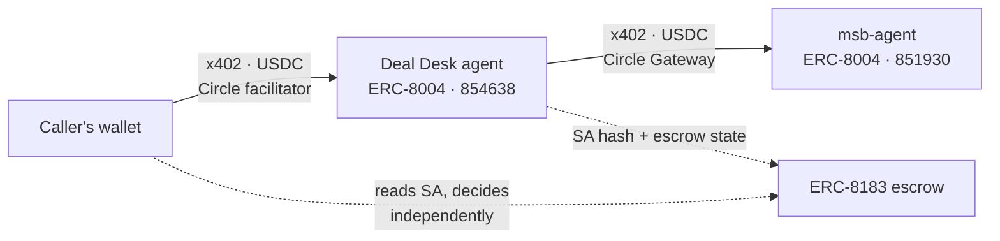

<div align="center">

# Citely Deal Desk

**Turn a cross-border compliance question into a Settlement Authorization
— a conditional proof your own wallet verifies before it releases a cent.**

[](https://docs.arc.io)
[](https://testnet.arcscan.app/tx/0x6385f21b8e1470dc23e25d49d92414c9c432d5d7e34c7ff49a5b631e7f2fd888)
[](https://eips.ethereum.org/EIPS/eip-8183)
[](https://developers.circle.com)

[中文文档](README.zh-CN.md) ·
[**Live demo UI**](https://citely-deal-desk-production.up.railway.app/app) ·
[Agent card](https://citely-deal-desk-production.up.railway.app/.well-known/agent-card.json) ·
[Compliance Module service](https://github.com/web3yaso/msb-agent)

</div>

---

## What You Get

Send a deal — who pays whom, from which countries, for what. Get back per-recipient
release conditions:

```json
{
  "case_id": "citely-demo-0001",
  "bound_to": { "job_id": "159786", "expires_at": "2026-08-04T00:00:00.000Z" },
  "modules_used": [{ "module_id": "us-msb", "version": "2026.07.1", "evidence_hash": "efdd1d1c…" }],
  "legs": [{
    "party": "uk_service_agent",
    "payee": "0x…",
    "condition": "HOLD",
    "basis": [{ "item_id": "MT-03", "verdict": "gray_data", "source": "31 CFR § 1010.100(ff)" }],
    "confidence": "gray_data_resolved"
  }],
  "attestation": { "sa_hash": "0xa6a6ff4a…", "signer": "0x4569…", "signature": "0x…" }
}
```

`condition` is `PASS` / `HOLD` / `ESCALATE`. `basis` cites the check item and the statute.
`attestation` is an EIP-712 signature your wallet verifies offline. The SA binds job,
payee, amount, module version, evidence hash and expiry — a constrained execution
credential, not an open-ended report.

> **An SA is a conditional proof, not a payment instruction.** Citely never touches
> client funds. Output is compiled from public legal sources; not legal advice.

---

## Call It As An Agent

Deal Desk is a live, registered agent — not a library you vendor in.

> Prefer a browser? The [**demo UI**](https://citely-deal-desk-production.up.railway.app/app)
> walks the same flow with your wallet as the 8183 client — it opens the escrow job and
> funds it; Citely never touches the money. Usage guide: [`docs/demo-ui.md`](docs/demo-ui.md).

**Find it — ERC-8004.** Agent `854638` on registry `0x8004A818…BD9e`
([registration tx](https://testnet.arcscan.app/tx/0x6385f21b8e1470dc23e25d49d92414c9c432d5d7e34c7ff49a5b631e7f2fd888)).
`tokenURI(854638)` resolves to the
[agent card](https://citely-deal-desk-production.up.railway.app/.well-known/agent-card.json) —
capabilities, pricing and endpoints are discoverable on-chain without asking us.

**Pay for it — x402.** `POST /cases` is metered: no API key, no account. The first
request returns `402` with a quote; `@circle-fin/x402-batching` does the whole
handshake in one call:

```ts
const gw = new GatewayClient({ chain: "arcTestnet", privateKey });
const { data } = await gw.pay(`${BASE}/cases`, { method: "POST", body: deal });
```

> Pre-fund a **Circle Gateway** balance first — x402 spends that, not your wallet's
> USDC. And the quote's `verifyingContract` is the Gateway Wallet, **not** the USDC
> contract; signing against USDC is the most common failure here.

**Settle it — ERC-8183.** The SA binds to a job on the
[reference deployment](https://eips.ethereum.org/EIPS/eip-8183) at `0x0747EEf0…4583`.
Three roles, three separate keys:

| Role | Who | Calls |
|---|---|---|
| `client` | you | `createJob`, `approve`+`fund`, `claimRefund` |
| `provider` | Citely | `setBudget`, `submit` |
| `evaluator` | Citely's verifier | `complete`, `reject` |

Your funds sit in the 8183 escrow, never in ours. `submit` anchors only the SA's hash;
the document stays off-chain.

**Escalations open a second job.** When a leg returns `ESCALATE`, the SA carries a
Review Job template — a separate 8183 job where you are the client, an independent
expert is the provider, and our verifier adjudicates. The expert is paid by whoever
asked for the review, never by us. Verified on-chain: job `162523`.

---

## Built on Arc + Circle Agent Stack

Two agents, two wallets, paying each other in USDC — no human in the loop.



| Component | Where | Evidence |
|---|---|---|
| **Arc** | Every transaction | `viem`'s official `arcTestnet`, chainId `5042002`. Gas is denominated in **USDC** — five physically separated wallets, each holding a single asset |
| **Nanopayments / Circle Gateway** | Buying evidence from msb-agent | `@circle-fin/x402-batching`; real settlement `566e5a78-…`, 0.80 USDC, Gateway balance 2.70 → 1.90 |
| **Circle hosted x402 facilitator** | Charging for `POST /cases` | `gateway-api-testnet.circle.com/v1/x402` — not self-hosted |
| **x402, both directions** | Buyer (`x402-client.ts`) and seller (`x402-server.ts`) | Earning and spending are the same money loop |

Not used, so nobody has to guess: Circle Agent Wallets (our key isolation is five
separate keys; wallet-level policy guardrails are the natural next step), Agent
Marketplace (prerequisites already met, not yet listed), CLI/Skills, App Kits, CCTP,
Paymaster, StableFX.

---

## The Compliance Module Service

Deal Desk contains no legal knowledge base. It **buys evidence per call** from
[msb-agent](https://github.com/web3yaso/msb-agent) — a separate repository, deployment,
wallet, ERC-8004 identity (`851930`), and price list (0.80 / 0.40 / 0.60 / 0.20 USDC
across `us-msb` · `uk-msb` · `eu-msb` · `sg-msb`).

That separation is the point: a monolith logging "paid 0.80" proves nothing. Here the
0.80 leaves one agent's Gateway balance and lands in another's — two independently
deployed services transacting because the protocol allows it, not because one imports
the other. Swapping suppliers means changing one environment variable
(`MSB_AGENT_BASE_URL`); there is no build-time link between the repos.

---

## Two Design Commitments

**Release conditions are not decided by an LLM.** `PASS` / `HOLD` / `ESCALATE` derive
only from the module's returned check results. The model orchestrates and summarizes;
the policy engine's function signature cannot receive a model verdict — it does not
type-check. An injection regression feeds a fully subverted model output and asserts
every condition is byte-identical to the honest run.

**Citely never touches your money.** Case funds live in the 8183 escrow; we collect a
case fee and pay module procurement, nothing else. Payment targets are always the
payees named in the SA. (One honest caveat, also stated in the agent card: today the
verifier runs in the same process as the main service; splitting it out is in progress.)

---

## Getting Started

```bash
pnpm install
cp .env.example .env      # five chain keys + OpenAI key; every field documented inline

node --import tsx scripts/doctor.ts              # health check, never prints a key
node --import tsx scripts/gateway-deposit.ts 1.50 # x402 spends Gateway balance — deposits take minutes

node --import tsx demo/run-vertical-slice.ts --dry-run   # no transactions, no spend
node --import tsx demo/run-vertical-slice.ts             # real Arc Testnet
```

> Public RPCs rate-limit in both directions; failover is built in, but for demos pin
> `ARC_RPC_URL=https://arc-testnet.drpc.org`.

---

## Verified On-Chain

Everything below was executed, not asserted — full log with tx hashes in
[`docs/design/testnet-run-log.md`](docs/design/testnet-run-log.md).

| | Evidence |
|---|---|
| Exit 1 — reject before submit | Job `159987`, full refund |
| Exit 2 — high confidence, end to end | Job `159786` → `complete` |
| Exit 3 — buy missing evidence | Settlement `566e5a78-…`, 0.80 USDC actually left the wallet |
| Exit 4 — escalate to human | Job `162523`, expert paid by the client, not by us |
| Exit 5 — timeout | Job `159988`, `claimRefund` → `Expired`, no fee taken |
| Reproducibility | Same input → byte-identical `sa_hash`; offline replay via golden cache |
| Injection defense | Live model, 10 calls: verdicts unchanged; defense is the deterministic union, not model self-reporting |

---

## License

Arc Testnet demo only, no real funds. Compliance verdicts derive from demo modules
built on public legal sources and do not constitute legal advice.
