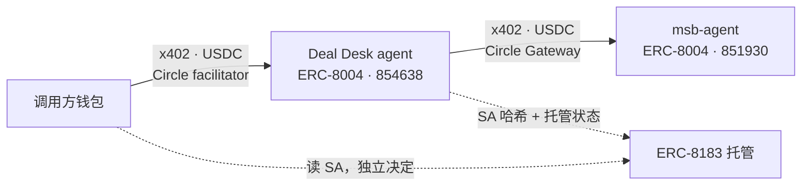

<div align="center">

# Citely Deal Desk

**把一笔跨境付款的合规问题，变成一份 Settlement Authorization
—— 由你自己的钱包在放款前独立核验的条件证明。**

[English](README.md) ·
[**演示 UI**](https://citely-deal-desk-production.up.railway.app/app) ·
[线上 agent card](https://citely-deal-desk-production.up.railway.app/.well-known/agent-card.json) ·
[合规 Module 服务](https://github.com/web3yaso/msb-agent)

</div>

---

## 能拿到什么

给它一笔交易——谁付给谁、从哪国到哪国、做什么。它返回逐收款方的放款条件：

```json
{
  "case_id": "citely-demo-0001",
  "bound_to": { "job_id": "159786", "expires_at": "2026-08-04T00:00:00.000Z" },
  "modules_used": [{ "module_id": "us-msb", "version": "2026.07.1", "evidence_hash": "efdd1d1c…" }],
  "legs": [{
    "party": "uk_service_agent",
    "payee": "0x…",
    "condition": "HOLD",
    "basis": [{ "item_id": "MT-03", "verdict": "gray_data", "source": "31 CFR § 1010.100(ff)" }],
    "confidence": "gray_data_resolved"
  }],
  "attestation": { "sa_hash": "0xa6a6ff4a…", "signer": "0x4569…", "signature": "0x…" }
}
```

`condition` 只有三种：`PASS`（可放款）、`HOLD`（暂缓）、`ESCALATE`（需人工复核）。
`basis` 给出判定项与法源引用，`attestation` 是钱包可离线验签的 EIP-712 签名。
SA 绑定 job、收款方、金额、Module 版本、证据哈希与有效期——是**受限执行凭证**，
不是一份开放式报告。

> **SA 是条件证明，不是付款指令。** Citely 不碰客户资金。
> 输出为公开法源整理的检查项状态，不构成法律意见。

---

## 作为 agent 调用它

Deal Desk 是一个上线并注册在链上的 agent，不是一个你 vendor 进项目的库。

> 想用浏览器试？[**演示 UI**](https://citely-deal-desk-production.up.railway.app/app)
> 里你以 8183 client 的身份提交一个任务，拿回这个任务已完成的 verification——
> 建托管 Job、注资都由你的钱包亲自签，Citely 全程碰不到钱。
> 使用说明：[`docs/demo-ui.md`](docs/demo-ui.md)。

**找到它 —— ERC-8004。** Agent `854638`，注册表 `0x8004A818…BD9e`
（[注册 tx](https://testnet.arcscan.app/tx/0x6385f21b8e1470dc23e25d49d92414c9c432d5d7e34c7ff49a5b631e7f2fd888)）。
`tokenURI(854638)` 解析到
[agent card](https://citely-deal-desk-production.up.railway.app/.well-known/agent-card.json)——
能力、定价、端点链上可发现，不用问我们。

**付费调用 —— x402。** `POST /cases` 按次计费：无需 API key、无需开户。
首次请求返回 `402` 报价单，`@circle-fin/x402-batching` 一行完成整个握手：

```ts
const gw = new GatewayClient({ chain: "arcTestnet", privateKey });
const { data } = await gw.pay(`${BASE}/cases`, { method: "POST", body: deal });
```

> 必须先给 **Circle Gateway** 预存余额——x402 花的是它，不是钱包里的 USDC。
> 报价单里 `verifyingContract` 是 Gateway Wallet 合约**而不是** USDC 合约，
> 对着 USDC 签名是这里最常见的失败方式。

**结算 —— ERC-8183。** SA 绑定到
[参考部署](https://eips.ethereum.org/EIPS/eip-8183) `0x0747EEf0…4583` 上的一个 Job。
三个角色、三把独立密钥：

| 角色 | 谁 | 调用 |
|---|---|---|
| `client` | 你 | `createJob`、`approve`+`fund`、`claimRefund` |
| `provider` | Citely | `setBudget`、`submit` |
| `evaluator` | Citely 的验证器 | `complete`、`reject` |

你的资金在 8183 托管里，从不经过我们的地址。`submit` 只把 SA 的哈希锚定上链，
文档本身留在链下。

**升级会开第二个 Job。** 某条腿返回 `ESCALATE` 时，SA 附带一份 Review Job 模板——
一个独立的 8183 Job：你是 client 并注资，独立专家是 provider，我们的验证器裁定。
专家酬金由提出复核的一方支付，永远不来自我们。链上已验证：Job `162523`。

---

## 构建在 Arc + Circle Agent Stack 之上

两个 agent、两个钱包，用 USDC 互相付钱——没有人在中间。



| 组件 | 用在哪 | 证据 |
|---|---|---|
| **Arc** | 所有交易 | `viem` 官方 `arcTestnet`，chainId `5042002`。gas 就是 **USDC** 计价——五个物理分离的钱包，每个只持有一种资产 |
| **Nanopayments / Circle Gateway** | 向 msb-agent 买证据 | `@circle-fin/x402-batching`；真实结算 `566e5a78-…`，0.80 USDC，Gateway 余额 2.70 → 1.90 |
| **Circle 托管的 x402 facilitator** | `POST /cases` 收费 | `gateway-api-testnet.circle.com/v1/x402`——不是自建的 |
| **x402 双向** | 买方（`x402-client.ts`）与卖方（`x402-server.ts`） | 赚的和花的是同一个资金闭环 |

没用的也列出来，省得别人猜：Circle Agent Wallets（我们的密钥隔离是五把物理分离的
钥匙；钱包层策略护栏是自然的下一步）、Agent Marketplace（前置条件已满足，尚未上架）、
CLI/Skills、App Kits、CCTP、Paymaster、StableFX。

---

## 合规 Module 服务

Deal Desk 自己不含法律知识库，它**按次向
[msb-agent](https://github.com/web3yaso/msb-agent) 付费购买证据**——独立仓库、
独立部署、独立钱包、独立 ERC-8004 身份（`851930`）、独立定价
（`us-msb` · `uk-msb` · `eu-msb` · `sg-msb` · `ae-msb`，
0.80 / 0.40 / 0.60 / 0.20 / 1.00 USDC）。**五个模块现已全部接入**——
`ae-msb`（阿联酋）于 2026-08 接入本仓库的模块校验器，单价 **1.00 USDC**，
是五个模块里最贵的一个。

关于 `ae-msb`，有两件事直说，不含糊：

- **它复用 `us-msb` 的 rubric。** 目前没有 `rubrics/ae-msb.json`，而 rubric 的选择
  与 `MODULE_ID` 相互独立。因此判定器会拿一组**美国口径**的问题去问一笔阿联酋交易，
  结果预期偏向 HOLD/ESCALATE 并路由到人工升级。这是 fail-closed 的——不会误放行——
  但我们**不主张**具备阿联酋判定能力。UAE rubric 已排期，尚未编写。
- **在认证清单重签之前**，`ae-msb` 案件会在验证器检查②以
  `attestation_missing: ae-msb@2026.08.1` 失败，案件走 reject 路径（escrow 退回客户）。
  同样是 fail-closed，同样是有意为之：重签需要一把离线密钥，不属于本次变更。

这个分离就是意义所在：单体应用打一行"已付 0.80"的日志什么也证明不了；这里的
0.80 是真的离开了一个 agent 的 Gateway 余额、到了另一个 agent 那里——两个独立
部署的服务，因为协议允许而交易，不是因为其中一个 import 了另一个。换供应商只需
改一个环境变量（`MSB_AGENT_BASE_URL`），两个仓库之间没有构建期链接。

---

## 两条设计承诺

**放款条件不由 LLM 决定。** `PASS` / `HOLD` / `ESCALATE` 完全由 Module 返回的检查
结果推导。模型只做编排与摘要——规则引擎的函数签名在类型层面就拿不到模型输出。
注入回归测试喂给系统一份完全被劫持的模型输出，断言每条腿的 condition 与诚实
运行逐字节一致。

**Citely 不碰你的钱。** 案件款托管在 8183 合约里，我们只收案件费、只支出 Module
采购费。付款目标恒为 SA 里的收款方。（一条如实的说明，agent card 里也是这么写的：
当前验证器与主服务同进程，拆成独立服务进行中。）

---

## 快速开始

```bash
pnpm install
cp .env.example .env      # 五把链上密钥 + OpenAI key，各字段说明见文件内注释

node --import tsx scripts/doctor.ts               # 环境体检，不打印任何密钥
node --import tsx scripts/gateway-deposit.ts 1.50 # x402 花 Gateway 余额——到账是分钟级

node --import tsx demo/run-vertical-slice.ts --dry-run   # 不发交易、不付费
node --import tsx demo/run-vertical-slice.ts             # 真实 Arc Testnet
```

> 公共 RPC 双向都会限流；降级已内置，但演示时建议直接
> `ARC_RPC_URL=https://arc-testnet.drpc.org`。

---

## 链上已验证

以下每一条都是跑出来的，不是声称的——完整日志与 tx 哈希见
[`docs/design/testnet-run-log.md`](docs/design/testnet-run-log.md)。

| | 证据 |
|---|---|
| 出口 1 —— 受理失败拒收 | Job `159987`，全额退款 |
| 出口 2 —— 高置信端到端 | Job `159786` → `complete` |
| 出口 3 —— 付费补证据 | 结算 `566e5a78-…`，0.80 USDC 真实离开钱包 |
| 出口 4 —— 升级人工复核 | Job `162523`，专家酬金由委托方支付，不来自我们 |
| 出口 5 —— 超时退款 | Job `159988`，`claimRefund` → `Expired`，不扣费 |
| 可复现性 | 同一输入 → `sa_hash` 逐字节一致；golden 缓存支持离线重放 |
| 注入防御 | 真实模型 10 次调用判定不变；防御靠确定性并集，不靠模型自觉 |

---

## 免责

仅用于 Arc Testnet 演示，无真实资金。合规判定来自公开法源整理的 Demo Module，
不构成法律意见。
